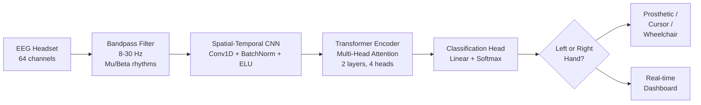

# Brain2Hand

**An EEG-based Brain-Computer Interface that lets paralyzed and limb-impaired patients control digital interfaces and prosthetics with thought alone.**

Submission for the **AI Ready ASEAN Youth Challenge 2026** — Team B2H, Cambodia Academy of Digital Technology (CADT).

---

## The Problem We Are Solving

Across Southeast Asia, more than **60 million people live with a disability**, and a significant share have lost motor function through stroke, spinal-cord injury, ALS, or amputation. Commercial Brain-Computer Interfaces that could restore agency cost **USD 10,000+**, require bulky hardware, or involve invasive surgery — placing them completely out of reach for patients in Cambodia, Laos, Myanmar, and rural areas across the region.

**Brain2Hand** is our answer: a low-cost, non-invasive, cloud-powered BCI that decodes *motor imagery* — the mental act of imagining a hand movement — directly from scalp EEG signals, and translates it into control commands in real time.

### Alignment with Google.org Focus Areas

| Focus Area | How Brain2Hand Contributes |
|---|---|
| **Stronger Communities** | Restores agency and independence to patients with severe motor impairment, reducing social isolation and caregiver dependency. |
| **Scientific Progress** | Advances accessible neurotechnology in ASEAN by demonstrating that transformer-based EEG decoding can run on commodity hardware. |
| **Knowledge, Skills & Learning** | Opens a pathway for stroke patients to rebuild neural pathways through neurofeedback training — learning to move again by watching their brain. |

---

## The Solution at a Glance

Brain2Hand is a **Hybrid CNN-Transformer** trained on the PhysioNet Motor Imagery Dataset (109 subjects, 64 EEG channels). Given a 4-second EEG window, it predicts whether the user is imagining a **left-hand** or **right-hand** movement, and streams that decision to a downstream controller (prosthetic, cursor, wheelchair, or neurofeedback display).



### Why a Hybrid CNN-Transformer?

Most existing EEG classifiers (EEGNet, DeepConvNet) are pure CNNs. CNNs are strong at local spatial features but struggle with **long-range temporal dependencies** — which is exactly where motor imagery signals live. A pure Transformer, on the other hand, is data-hungry and slow to train on small EEG datasets.

Our hybrid takes the best of both:
- **CNN front-end** extracts compact spatial-temporal features from the 64-channel raw signal and downsamples aggressively, turning 641 timesteps into a manageable sequence.
- **Transformer back-end** applies multi-head self-attention over that sequence, learning which *moments* in the 4-second window carry the motor imagery signature.

This mirrors recent advances in speech and vision, but applied to brain signals — and it is fully open-source, unlike the proprietary pipelines used in commercial BCIs.

---

## Results

Training and evaluation are run on **Lightning AI** (NVIDIA GPU). Artifacts below are regenerated after each full run and committed back to this repo so reviewers can see real numbers without re-running anything.

| Metric | Value |
|---|---|
| Dataset | PhysioNet EEG Motor Imagery (see `src/config.py` for subject mode) |
| Classes | Left Hand, Right Hand |
| Input | 4-second windows, 64 channels, 160 Hz |
| Model parameters | ~200K (lightweight, deployable on edge) |

**Figures** (generated by `src/plot.py`, saved to `results/`):

- `results/01_training_curves.png` — loss and validation accuracy over epochs
- `results/02_confusion_matrix.png` — per-class confusion matrix
- `results/03_class_metrics.png` — precision / recall / F1 per class
- `results/04_roc_curve.png` — ROC curve with AUC
- `results/05_eeg_sample.png` — sample left vs right hand EEG epochs
- `results/history.json` — raw training history

See [`results/README.md`](results/README.md) for how these are produced and committed.

---

## Repository Structure

```
src/
  model.py     Hybrid CNN-Transformer architecture (PyTorch)
  dataset.py   PhysioNet loader + MNE preprocessing pipeline
  train.py     Training loop with cosine LR schedule + early stopping
  eval.py      Evaluate a trained checkpoint on held-out data
  tune.py      Optuna hyperparameter search
  plot.py      Generates all publication-quality figures in results/
  app.py       Streamlit real-time inference dashboard
  demo.py      Command-line inference demo
  config.py    Central config (subject mode, device, hyperparameters)
results/       Training artifacts, checkpoints plots, and metrics (committed)
docs/          Context documents and submission materials
proposal.html  Full written proposal (5-page PDF equivalent)
```

---

## Running the Project

### Local / laptop (for inspecting or small tests)

```bash
pip install -r requirements.txt
# Edit src/config.py → set MODE = "LAPTOP" for a fast 2-subject run
python src/train.py
python src/plot.py
```

### Lightning AI (for real training runs)

This is the primary workflow. Code is developed locally and pushed to GitHub; training runs on Lightning AI GPUs.

```bash
# On Lightning AI studio
git pull
# Edit src/config.py → MODE = "CLOUD" (25 subjects) or "FULL" (109 subjects)
python src/train.py          # trains and writes results/history.json + checkpoint
python src/plot.py           # regenerates all PNGs in results/

# Then back on local:
git pull                     # pull the updated results/ from Lightning AI
git add results/ checkpoints/
git commit -m "Update results from Lightning AI run"
git push
```

### Hyperparameter tuning

```bash
python src/tune.py          # runs Optuna study, writes best_params.json
python src/train.py         # train.py auto-loads best_params.json if present
```

---

## Technical Stack

- **Deep Learning**: PyTorch 2.x
- **EEG Processing**: MNE-Python (bandpass filtering, epoching, artifact handling)
- **Dataset**: PhysioNet EEG Motor Movement/Imagery Dataset
- **Hyperparameter Tuning**: Optuna
- **Training Infrastructure**: Lightning AI (NVIDIA GPU)
- **Demo Interface**: Streamlit
- **Visualization**: Matplotlib, Seaborn

---

## Team

- **Sopanha Lay** — Team Captain, model architecture and training
- **Chehnintchesda You** — Data pipeline and evaluation
- **Nesta Hou** — Faculty Advisor

Cambodia Academy of Digital Technology (CADT), Phnom Penh, Cambodia.

---

## Full Proposal

The complete written proposal, including feasibility analysis, scalability plan, and the 1,000-member community outreach strategy, is in [`proposal.html`](proposal.html).
