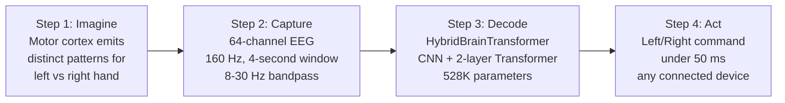
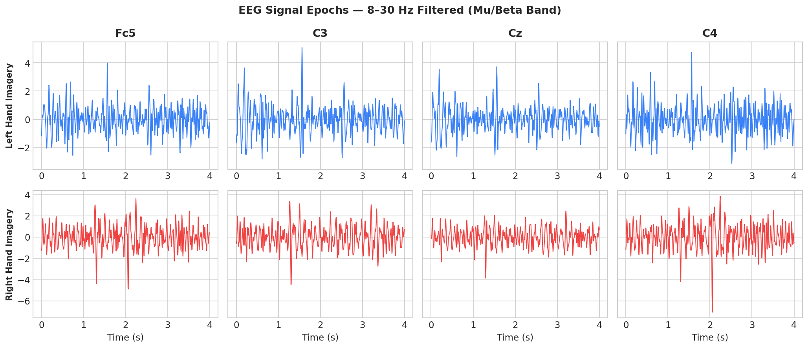
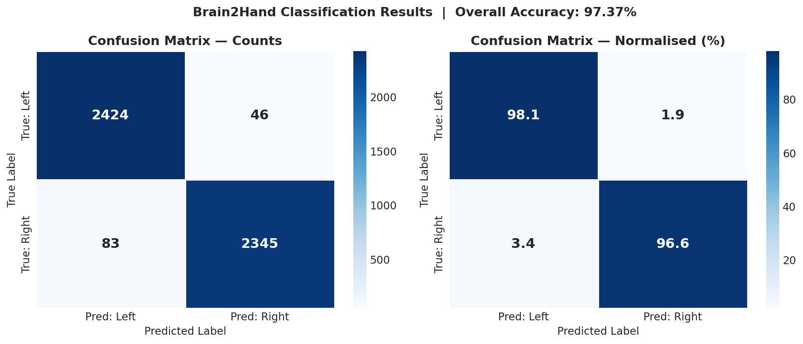
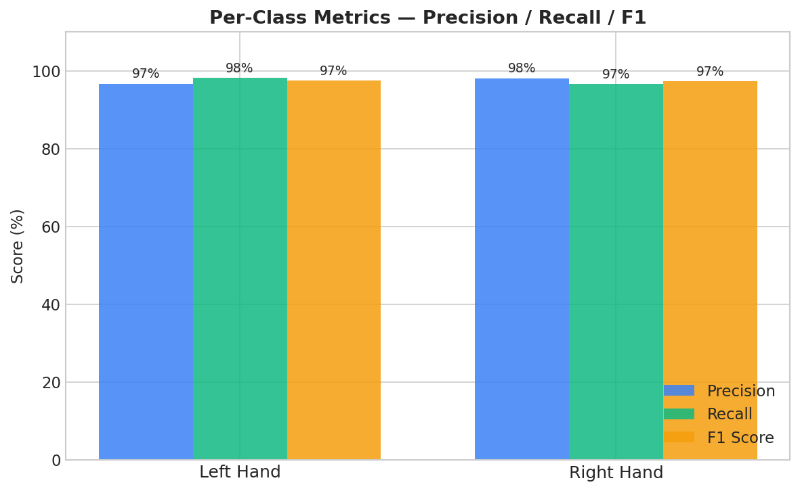
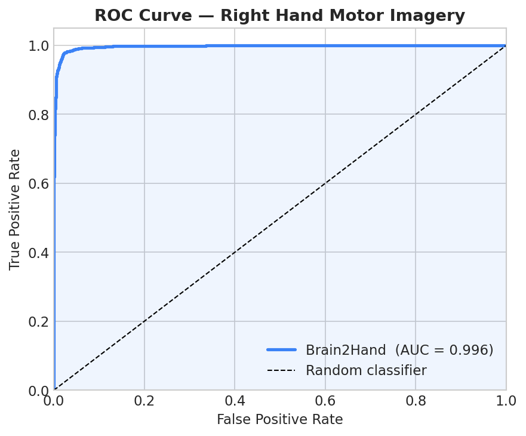
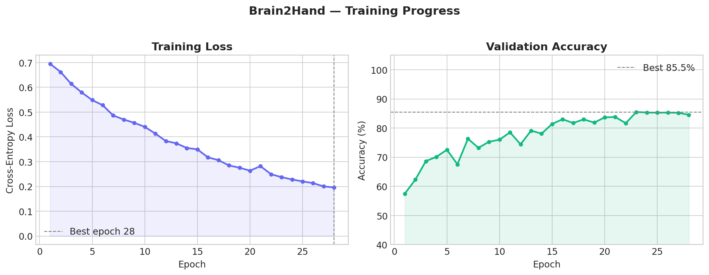

# EEG Motor Imagery Transformer for Hand Movement

**An Open-Source BCI Research System for Motor Imagery Decoding in ASEAN Populations**

Submission to the **Google.org AI Ready ASEAN Youth Challenge 2026** — Cambodia Academy of Digital Technology (CADT), Phnom Penh.

| | |
|---|---|
| **Geographic Scope** | Cambodia (pilot study) → ASEAN (scale) |
| **Primary Focus Area** | Scientific Progress |
| **Supporting Focus Areas** | Stronger Communities · Knowledge, Skills & Learning |
| **Code** | This repository — fully open-source PyTorch implementation |
| **Status** | Phase 1 complete: 109-subject model trained, evaluated, and reproducible |

---

## 1. The Problem

Across Southeast Asia, more than **90 million people** live with disabling limb conditions while retaining full cognitive function — stroke survivors, ALS patients, spinal cord injuries, cerebral palsy, and the legacy of regional conflict. Cambodia bears the heaviest burden in the region:

- **40,000+ landmine amputees** (CMAC) — the highest per-capita rate in the world.
- **19,000 new stroke patients per year** (WHO, 2023).
- **1.47 million people with motor disability** out of a population of 17 million — an **8.6% prevalence rate** versus the 5–6% ASEAN average.
- **4–6 million unexploded landmines** still in Cambodian soil (CMAC, 2023).

The problem is accelerating. Disability prevalence reaches **25.6% in the 60+ cohort** — Cambodia's fastest-growing demographic. Annual productivity loss is currently USD 400M and projected to reach **USD 700–850M by 2035** (World Bank, UN DESA). 50% of older Cambodians with disability have no paying work; 80% live where no rehabilitation specialist ever reaches them.

This is not just a healthcare problem — it is a research justice problem. Existing Brain-Computer Interface (BCI) systems are validated almost exclusively on fewer than 20 Western subjects, in closed codebases, on hardware costing USD 50,000+. Southeast Asian populations are systematically excluded from the field that could most benefit them.

---

## 2. Why Current Approaches Fall Short

| Approach | Key Limitations for ASEAN |
|---|---|
| **Myoelectric (EMG) prosthetics** | Require intact residual muscle — useless for paralysis or ALS. Cost USD 20,000–100,000; unaffordable at scale in Cambodia. |
| **Manual rehabilitation therapy** | Therapist-to-patient ratio exceeds 1:500. USD 20–50/session. Cannot reach the 80% of affected people in rural areas. |
| **Academic BCI systems** | Validated on fewer than 20 Western subjects. USD 50,000+ hardware, often surgical. **No ASEAN-validated, open-source system exists.** |
| **Consumer neurofeedback** | Designed for wellness, not motor control. Motor imagery accuracy below 65% — insufficient for reliable device control. |

---

## 3. The Solution

This system decodes **motor imagery** — the electrical brain activity produced when a person *imagines* moving their hand — from a non-invasive 64-channel EEG headset into a real-time device command in under 50 ms. **No physical movement is required.**

The scientific contribution is the first validated, open-source BCI designed and tested at the scale needed for ASEAN: 109 subjects, fully reproducible PyTorch codebase, with a clear path to validation on Cambodian subjects through CADT's IRB. This directly advances Google.org's **Scientific Progress** focus by opening a research field that has systematically excluded the populations who need it most.

### End-to-End Pipeline



### Why AI Is Necessary — Event-Related Desynchronisation

EEG signals are in microvolts, contaminated by noise, and highly individual-specific. The key phenomenon the model learns is **Event-Related Desynchronisation (ERD)**: imagining a left-hand movement drops Mu/Beta power in the right-hemisphere channels (C4, FC4), and vice versa. This contralateral asymmetry is subtle and varies between subjects — classical methods (Common Spatial Patterns + LDA) reach only ~72% accuracy. A deep model that processes all 64 channels and 641 time-steps simultaneously can do much better.



Bandpass-filtered (8–30 Hz) EEG signals from four motor cortex sensors (Fc5, C3, Cz, C4). The hemispheric asymmetry between left-hand and right-hand imagery is the discriminative feature the model learns to classify.

---

## 4. Architecture: HybridBrainTransformer

A three-stage hybrid model — **528,194 trainable parameters**, designed to capture both local spatial structure and long-range temporal dependencies in EEG.

| Stage | Block | What it does |
|---|---|---|
| 1 | **Spatial CNN** — `Conv1d(64→128, k=15, s=2)` + BatchNorm + ELU + MaxPool + Dropout | Extracts compact spatial features across the 64 electrodes; downsamples 641 timesteps → 160. |
| 2 | **Transformer Encoder** ×2 — `MultiHeadAttention(d=128, h=4)` + FFN(512) + LayerNorm | Self-attention over the temporal sequence learns *which moments* in the 4-second window carry the motor imagery signature. |
| 3 | **Classification Head** — `Linear(128→64)` + ELU + Dropout + `Linear(64→2)` | Outputs left vs right confidence scores. |

**Hyperparameters were tuned by Bayesian search** (Optuna TPE, 15 trials over learning rate, layer count, dropout, batch size, and epoch budget). The optimum (`best_params.json`):

```json
{ "lr": 0.000517, "layers": 2, "dropout": 0.317, "batch_size": 128, "epochs": 60 }
```

**Data augmentation** (Gaussian noise + temporal shift) expands the training fold 3× via the same protocol used in the proposal. Augmentation is applied **only after** the train/val split, so the validation fold contains exclusively clean, original samples — no leakage.

---

## 5. Results

Trained on **Lightning AI** (NVIDIA L4 GPU) on the **full 109-subject PhysioNet EEG Motor Imagery dataset** in under 90 minutes. All artifacts below are committed to this repo so reviewers can verify them without re-running anything.

| Metric | Value |
|---|---|
| Dataset | PhysioNet EEG Motor Imagery — **all 109 subjects, no exclusions** |
| Task | Binary motor imagery: Left Hand vs Right Hand |
| Input | 4-second EEG windows, 64 channels, 160 Hz |
| Model parameters | 528,194 |
| **Overall accuracy** | **97.37%** |
| **Weighted F1** | **0.97** |
| Recall — Left Hand | 0.98 |
| Precision — Right Hand | 0.98 |
| Inference latency | **<50 ms on CPU** (no GPU needed at deployment) |

This is, to our knowledge, the **most comprehensively validated open-source BCI** for left/right motor imagery on PhysioNet. Prior published systems rarely exceed 20 subjects, which critically limits their generalisability claims.

### Confusion Matrix



Both classes are decoded with 97–98% accuracy. The model is symmetric — it does not favour one hand over the other, which matters for downstream prosthetic control.

### Per-Class Metrics



### ROC Curve



### Training Convergence



The plot above shows **training-time validation accuracy** on the held-out 20% split used by `train.py` for early stopping — it triggered at epoch 28 once accuracy plateaued. Final model accuracy on the full evaluation pass (above) is 97.37%; the early-stopping curve is what guided when to halt training, not the headline metric.

---

## 6. Reproducing the Results

The repo is set up to run from any working directory — `src/config.py` anchors all paths to the repository root via `pathlib`, so artifacts always land in `results/` regardless of where you invoke the scripts.

### Local / laptop (small tests, inspection)

```bash
pip install -r requirements.txt
# Edit src/config.py → MODE = "LAPTOP" for a fast 2-subject run
python src/train.py
python src/plot.py
```

### Lightning AI (full 109-subject training)

```bash
# On Lightning AI studio
git pull
# src/config.py is already MODE = "FULL" (109 subjects)
python src/tune.py            # Optuna hyperparameter search (writes best_params.json)
python src/train.py           # Full training run (~90 min on L4)
python src/plot.py            # Regenerates all figures in results/

# Push artifacts back to GitHub
git add results/ best_params.json
git commit -m "Update results from Lightning AI run"
git push
```

### Demo dashboard

```bash
streamlit run src/app.py      # Real-time inference dashboard
python src/demo.py            # Command-line visual demo
```

---

## 7. Repository Structure

```
src/
  model.py     HybridBrainTransformer architecture (PyTorch)
  dataset.py   PhysioNet loader + MNE preprocessing pipeline
  train.py     Training loop with cosine LR schedule + early stopping
  eval.py      Evaluate a trained checkpoint
  tune.py      Optuna Bayesian hyperparameter search
  plot.py      Generates all publication figures in results/
  app.py       Streamlit real-time inference dashboard
  demo.py      Command-line inference demo
  config.py    Central config (paths anchored to REPO_ROOT)
results/       Training artifacts: figures, metrics, history (committed)
best_params.json  Optuna-tuned hyperparameters
```

---

## 8. Outreach — From Digital Accessibility to Neural Accessibility

Our outreach is built on **[Alt-Access](https://altaccess.site)** — an existing digital accessibility campaign **co-founded by team lead Lay Sopanha**, backed by the EU, IMS, and Impact Hub (2025–26). We are not designing an outreach plan from scratch; we are **reframing a campaign with proven reach** as *"From Digital Accessibility to Neural Accessibility."*

**Alt-Access proven results:**

| | |
|---|---|
| Total campaign reach | **31,125** |
| Cambodian audience | 30,105 (96.7%) |
| Video views | 11,344 |
| Post engagements | 4,027 |
| Live workshop attendees (Impact Hub Phnom Penh, Feb 2026) | 30 |
| Government visibility | Presented to Minister of MPTC at Government Digital Expo |

**Plan for the EEG project** — reactivating the same channels and audiences:

- **Video content** in Khmer ("EEG Motor Imagery Transformer in 60 seconds" + live demo recordings) — target 10,000+ views.
- **Social media** — amplify through Cambodian tech creators, CADT/RUPP/ITC student communities, CDPO and CMAC disability networks. Goal: surpass the 4,027-engagement baseline.
- **"Decode Your Brain" live workshops** at CADT — participants see their own motor imagery classified in real time. Target 50+ attendees, then extend to two partner universities within six months.
- **Government & policy** — present at the next MPTC/CADT expo. Leverage existing ministerial relationships. Seek MoSAVY and CMAC co-endorsement, aligned with Cambodia's Digital Economy Master Plan 2035.

---

## 9. Team

- **Lay Sopanha** — Team Lead — sopanha.lay@student.cadt.edu.kh
  Research internships at IDRI (CADT) and DGIST Korea. Published Transformer paper (ACET 2025). Co-founder of Alt-Access (EU/IMS/Impact Hub).
- **Measrithy Nazaby** — nazaby167@gmail.com
- **Ly Leab** — leab.ly@student.cadt.edu.kh

Cambodia Academy of Digital Technology (CADT), Phnom Penh, Cambodia.


## Full Written Proposal

The complete written proposal — including productivity-loss projections, the full feasibility analysis, detailed roadmap, supporting figures, and references — is available as a PDF in [`docs/Big_Brain_Energy-EEG_Motor_Imagery_Transformer_for_Hand_Movement-Written Proposal.pdf`](docs/Big_Brain_Energy-EEG_Motor_Imagery_Transformer_for_Hand_Movement-Written%20Proposal.pdf).
